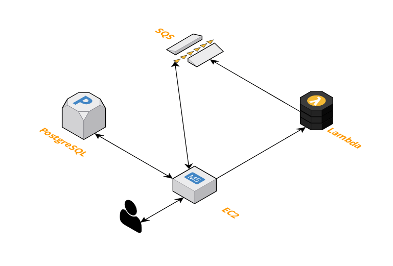

# location-cloud-function

Serverless function for retrieving latitude and longitude coordinates for a given location

Will be used by [backend application](https://github.com/mike-osu/capstone-api) for Crowd-Sourced Travel Planner

---

### To Do:

- [x] Create [Lambda function](https://aws.amazon.com/lambda/)
- [x] Invoke Google Maps Geolocation API 
- [x] Send coordinates to [SQS queue](https://aws.amazon.com/sqs/)
- [x] Enable SQS listener in backend
- [x] Update coordinates in [PostgreSQL](https://www.postgresql.org/) database

---
